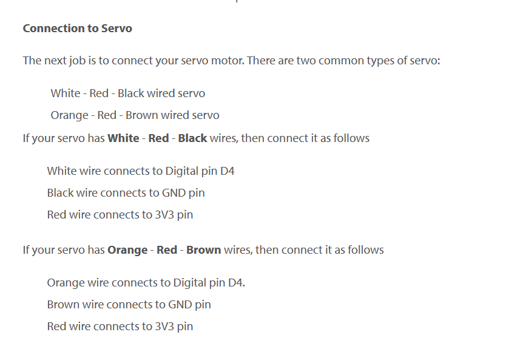

## Servo aansluiten

-lees:
```
- wij gaan nu een servo gebruiken
- een servo is een motor die van 0 tot 180 graden kan draaien
- met onze code geven we dat aan

- hiermee kun je dus iets laten bewegen, bv een robot 
```

## aansluiten

- pak 1 servo
- sluit deze aan op de manier zoals dit plaatje uitlegt!
    > ;

- pak de code uit de servo map
    - test je servo, beweegt die een beetje?


## robot bedenken

- bedenk een project om met 1 servo's een beweging/bewegend ding te knutselen

- wat we hebben aan materiaal:
```
- touw
- 1 servo's
- karton
- scharen
- schilders tape 
```

- voor inspiratie:
    > - https://www.youtube.com/watch?v=Le7o3ZBz7Gk
    > - https://www.youtube.com/watch?v=repNSX8TXOg

- teken je project uit op papier, design het dus eerst!


## hobby tijd?

- je kan ook helemaal los gaan!
> - bestuurbare robot hond https://www.youtube.com/watch?v=wF3MR8pRAGo
> - van alles ^^ https://duckduckgo.com/?t=ffab&q=cardboard+arduino+robots&iax=videos&ia=videos