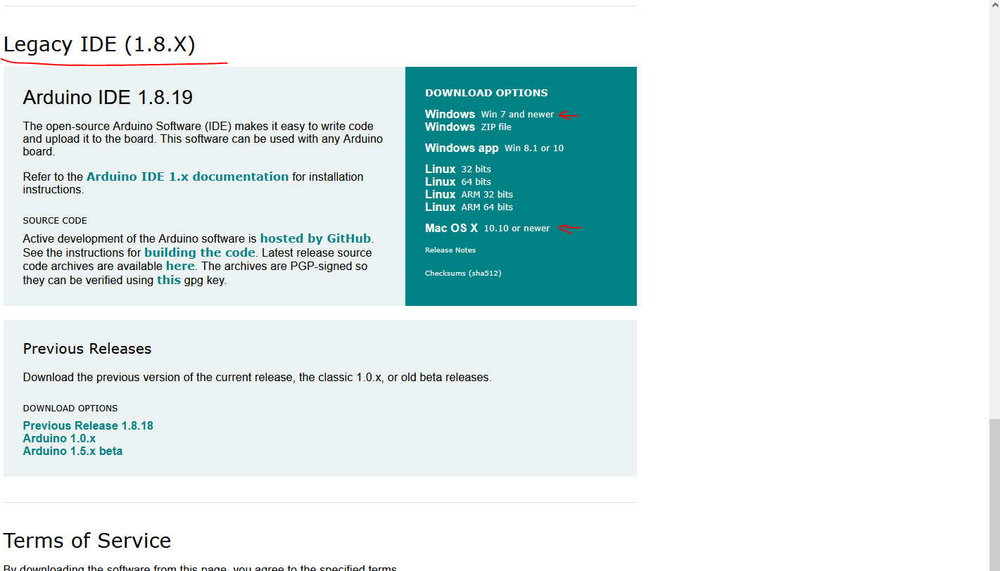
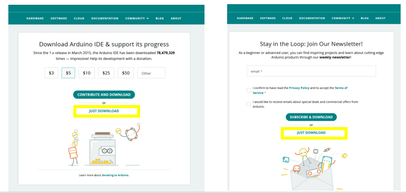

## IDE downloaden
- Ga naar https://www.arduino.cc/en/software
- Scroll naar beneden en download de Legacy versie
> deze dus
> 

- Kies de installatie passend voor jou laptop!

- Klik 2 maal op “just download”.
> Je hoeft hier dus niets in te vullen!
> 
- Installeer vervolgens de software in het engels! 
    - Klik “yes” op alles, dit zijn benodigde drivers.

## Start

- Start de Arduino IDE, en open:        
    - File -> Preferences
    > 

- Vink deze instellingen aan 
    > 
- plak de volgende link in het textfeld.
    - https://arduino.esp8266.com/stable/package_esp8266com_index.json

## Aansluiten

- sluit de NodeMCU met de USB kabel aan je laptop aan

- Ga naar:
    - Tools -> Board -> Boards Manager…
    > 
- zoek naar de esp8266
    - en installeer die
    > 

## Juiste board selecteren

- Ga naar:
    - Tools -> Board -> ESP8266 Boards -> NodeMCU 1.0 (ESP-12E Module)
    > 

## Poort

- Ga naar:
    - Tools -> Port
        - Selecteer de correcte port.
        > - De poort kan veranderen elke keer dat je de NodeMCU aansluit!
        > - soms moet je even alle poorten proberen
        
    > 

- werkt het niet?
     - werk dan door '00 poort problemen.md'