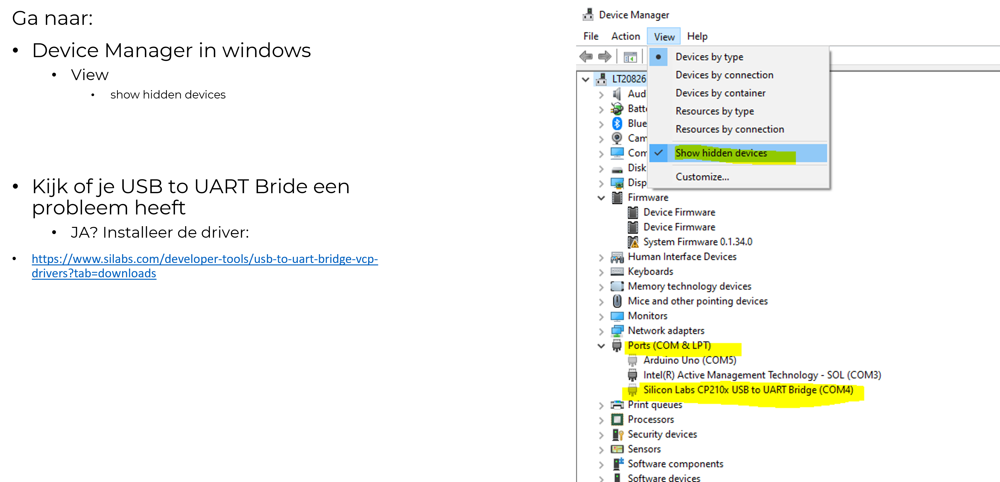

## Poort problemem

- LET OP!! deze is alleen als je problemen hebt

    - heb je dat niet sla deze over!!

## Device manager
- Ga naar:
    - Device Manager in windows
        - View
            - show hidden devices
    > 

- Kijk of je USB to UART Bride een probleem heeft
    - JA? Installeer de driver:
        - https://www.silabs.com/developer-tools/usb-to-uart-bridge-vcp-drivers?tab=downloads
