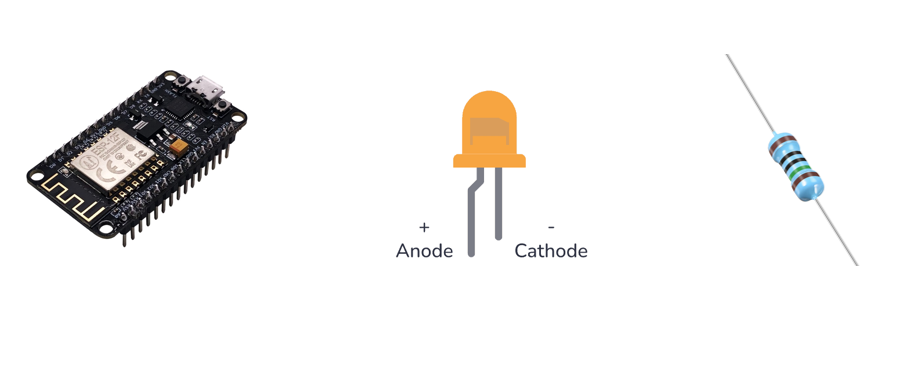

## Leds

- pak deze componenten:
    > 
    - kijk even naar de led en lees:
        > - Let op! De min – is de minderlange poot!
        > - als je de led verkeerd hebt doet die het niet
        
- Sluit alles zo aan:
    > 
    - Elke gekleurde lijn is een kabel!

