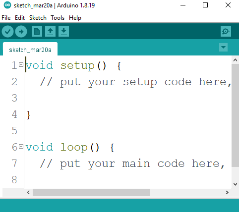
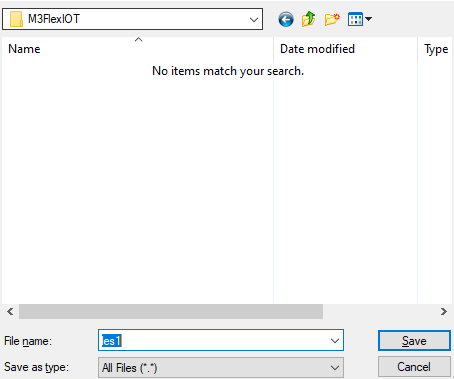
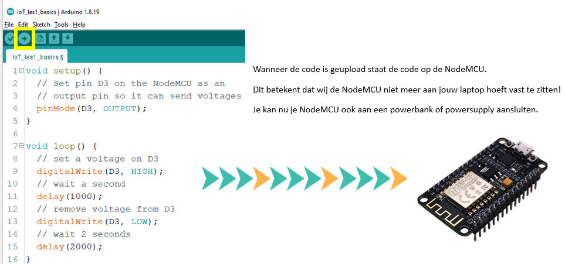
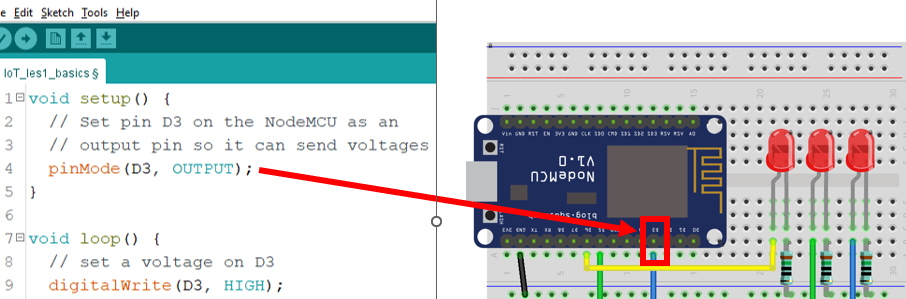
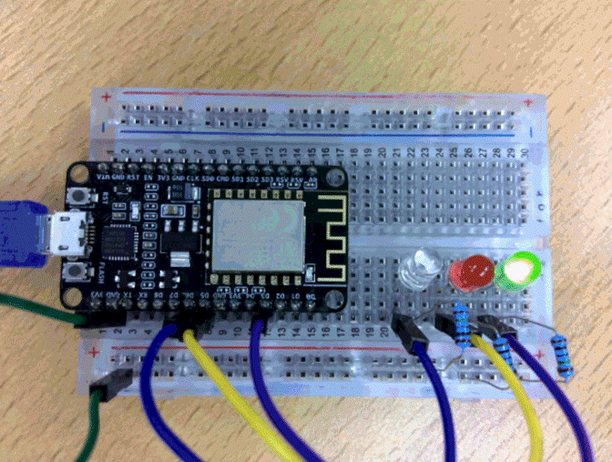

## Code

- open je arduino IDE
    - je hebt een lege sketch:
        > 

## Opslaan

- nieuwe sketch? meteen even opslaan
    - plaats de sketch onder je git repo
        - noem de sketch les1
            > 

## code

- verander je sketch zodat die er zo uitziet:
    > 

- upload nu je code naar je NodeMcu
    > 

- je rechter led zou nu aan en uit moeten gaan!

## Welke pin
- bekijk:
    > 
- lees:
    > - zie die D3 in je code?
    > - die zegt welke pin van de nodemcu we gebruiken
    > - hier dus de pin die met de blauwe kabel naar de rechter led loopt

## andere leds 
- om de andere leds te besturen moet we de pinmode zetten
    - kopieer de pinMode regel in setup
        - plak die 2x onder de pinMode regel
        > nu heb je dus 3x een pinmode regel
- verander de pin van de 2 nieuwe regels zodat:
    - deze naar de pins van de andere LED's wijzen
    > Hint: D...

## digitalWrite

- ga naar je loop function
    - zet nu onder je digitalWrite...HIGH nieuwe regels code die:
        - hetzelfde zijn, maar een andere PIN gebruiken
            - gebruik de pin's van de andere leds

## TEST
- upload je code
    - als het goed is branden nu alle 3 de leds!

## 1 voor 1

- pas je code aan:
    - Zet de lampjes 1 voor 1 aan.
        > 
        > - bekijk de ledchaser.gif in img als voorbeeld

## commit

- commit & push je code naar je git!