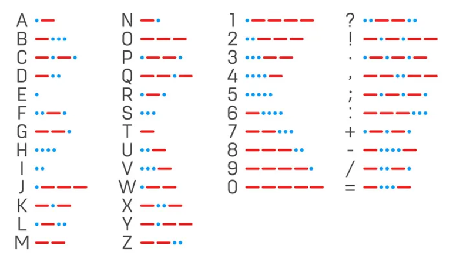

## Code

- open je arduino IDE
- start een nieuwe sketch
    - plaats de sketch onder je git repo
        - noem de sketch les1-morse

## Morse code

- bekijk dit plaatje:
    > 
    - de . is een kort signaal
    - de streep een lang signaal
 
- Schrijf nu code om jouw naam te schijven met morse code
    > - Zet bij stippen de lampjes aan voor 500 miliseconden
    > - Zet bij pauzes de lampjes uit voor 250 miliseconden
    > - Zet bij strepen de lampjes aan voor 1500 miliseconden
    > - Na een volledige letter staan de lampjes voor 500 miliseconden uit
    > - Na een woord staan de lampjes voor 1500 miliseconden uit 

## commit

- commit & push je code naar je git!