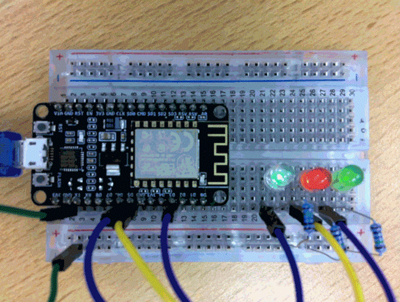

## Code

- open je arduino IDE
- start een nieuwe sketch
    - plaats de sketch onder je git repo
        - noem de sketch les1-dim

## leds dimmen

- maak nu code die 1 of meerder leds dimt:
    - HINT: Onderzoek zelf:   analogWrite()

- voorbeeld is te zien in dimmen.gif in de img directory
    > 
    
## commit

- commit & push je code naar je git!