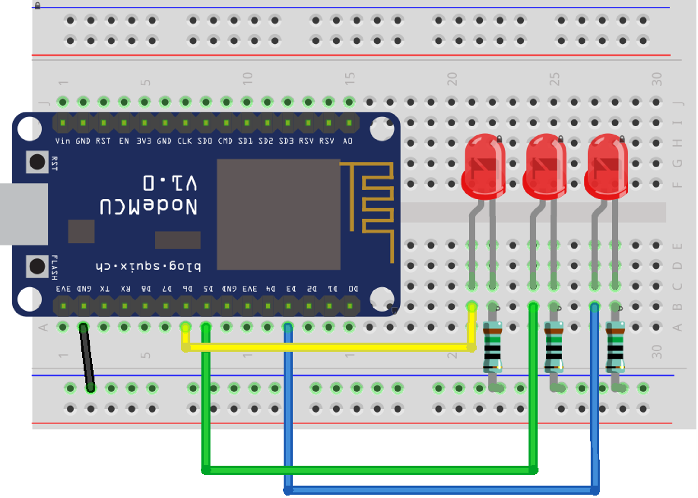

## hardware

- controlleer of alles in jouw bakje zit
    > 
    - NEE? loop even naar de leraar

## opzet hardware
- bouw je breadboard zo op:
    > 

## code opzet
    
- open je arduino IDE
- start een nieuwe sketch
    - plaats de sketch onder je git repo
        - noem de sketch:
            - les2-serial
    
## commit

- commit & push je code naar je git!
    