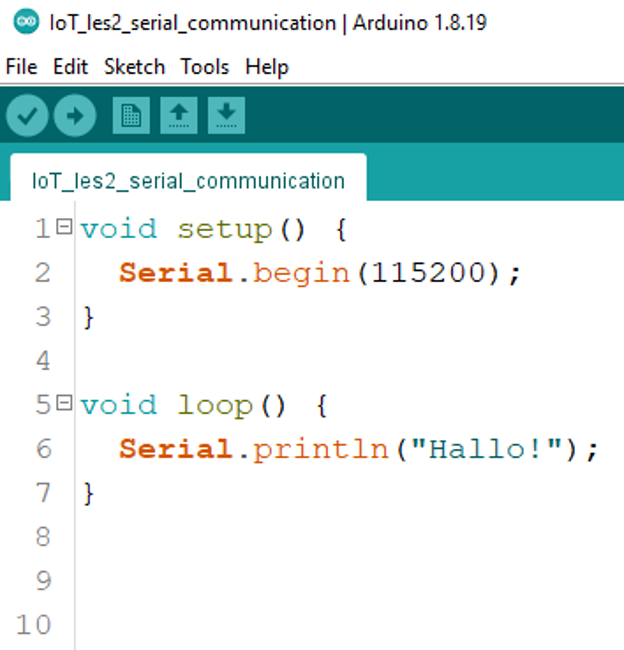

## code
    
- open je arduino IDE
- open je sketch:
            - les2-serial
    
## serial monitor

- open je serial monitor
    > - dit is je console voor arduino
    > 
- je krijgt dit scherm te zien:
    > 
    - zorg dat je de baud op 115200 zet

## code

- zet deze code in je sketch
    > 

- upload naar je nodemcu en test!
    - als het goed is zie je nu hallo verschijnen
    > 

## slow down!
- gebruik een delay om de hallo's:
    - wat langzamer te laten komen

## commit

- commit & push je code naar je git!
    