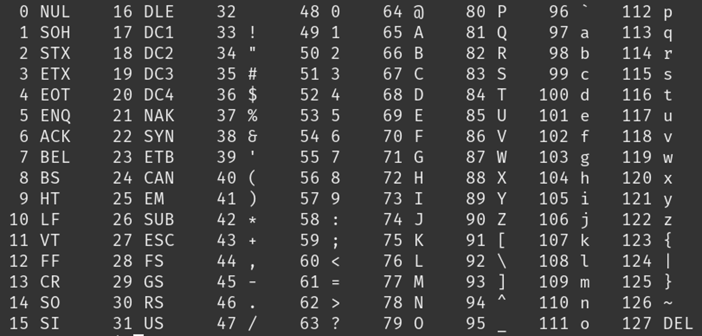

## code
    
- open je arduino IDE
- open je sketch:
            - les2-bin
    

## code

- Kies een woord.
- Maak voor elke letter een variabele aan:   
    - van het type char
- Om de letters daadwerkelijk met een letter te vullen, type het in binair in met:
    > char a = 0b01100001
    > - 0b geeft aan dat je een binair getal invult
    > - de getallen achter 0b zeggen nu dat het ‘a’ is.

- Wanneer je alle letters heb gemaakt, print ze dan allemaal in de Serial monitor.

- Zoek zelf op hoe je de getallen rechts omzet naar binair!

    > 

## commit

- commit & push je code naar je git!
    