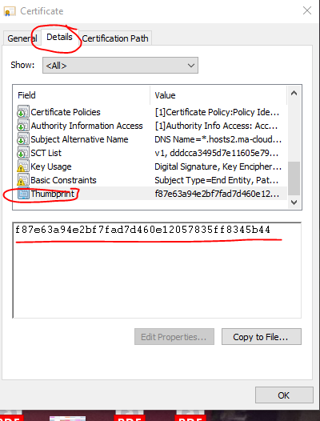
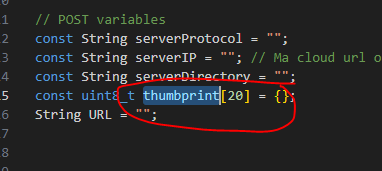
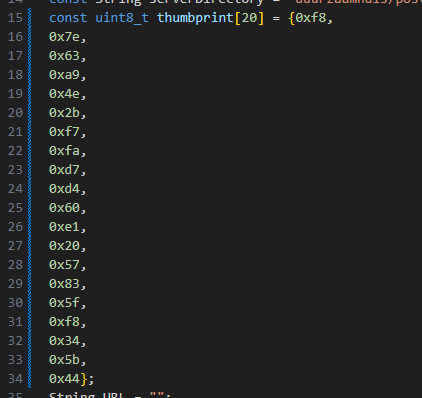

## thumbprint opvragen

- open EDGE
- ga naar jouw duurzaamhuis/post.php
- click op het certificaat icoon (1)
    > 
    - click op details (2)
    - click op export (3)
        - sla het certificaat op bij je code

- open nu het certificaat
    > 
    - click op details
    - click op thumbprint
    - kopieer de thumbprint

- ga naar een je wifi.ino
    - plak de thumbprint achter de `=` bij thumbprint[20]
    > 
    
    - voor elke 2 letter zet je een nieuwe regel
    > voorbeeld: eeff wordt:
    ```
        ee
        ff
    ```
    - zet overal 0x voor:
    ```
        0xee
        0xff
    ```
    - zet overal een komma achter (behalve de laatste) 
    ```
        0xee,
        0xff
    ```

    - dan krijg je zoiets:
    
    > 
